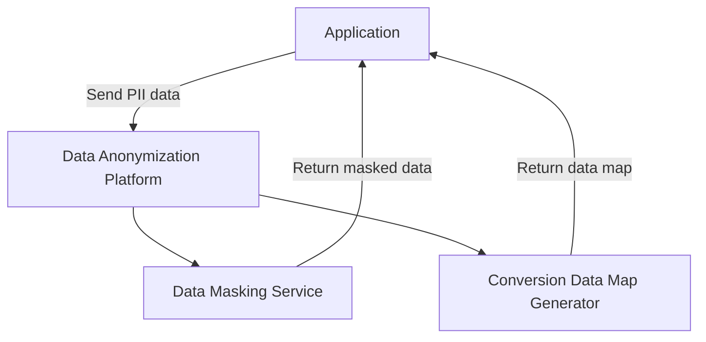
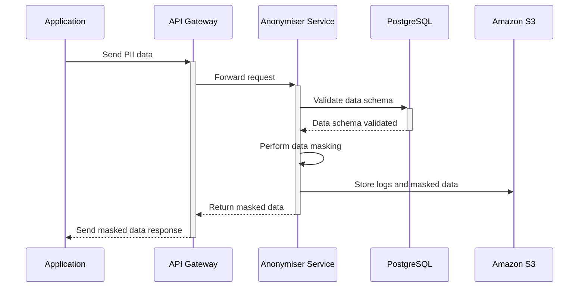
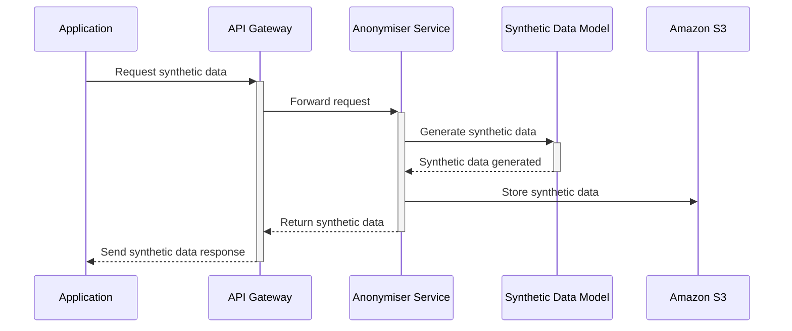
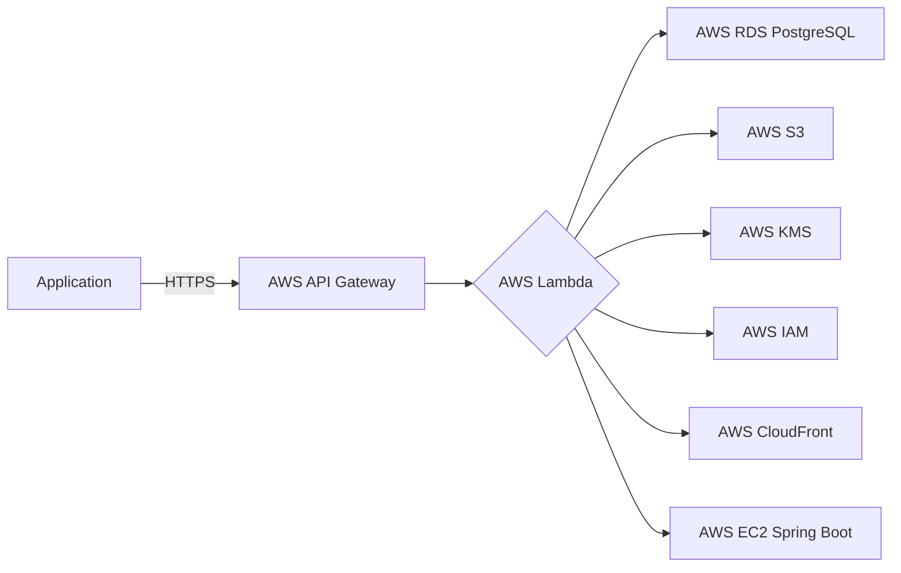
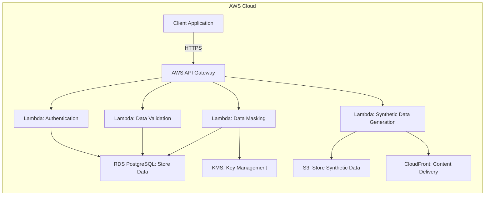

# Anonymiser

## Overview

The Data Anonymization Platform is a robust, industry-standard Java Spring Boot application designed to anonymise sensitive user data. By passing data to this platform, applications can receive masked data alongside a conversion data map, ensuring privacy while maintaining data utility. This platform complies with major data protection regulations such as GDPR, CCPA, and HIPAA, ensuring the highest standards of data privacy and security.

### Additional Consideration: Preserving Data Relationships in AI Applications

In many AI applications, it is critical to mask sensitive information without losing the relationships between data points. This platform leverages industry-leading methods such as *Differential Privacy* and *Synthetic Data Generation* to maintain data integrity and utility for machine learning and AI applications.

## Setup Guide

### Prerequisites

- **Java 21 or higher**
- **Maven 3.9.9 or higher**
- **Spring Boot 3.0 or higher**
- **PostgreSQL database** (optional for running in production)
- **TLS/SSL certificates** for secure communication

### Installation

1. **Clone the repository:**

    ```bash
    git clone https://github.com/lucasodra/anonymiser.git
    cd anonymiser
    ```

2. **Configure the application:**

   Modify the `application.properties` file under `src/main/resources` to configure your database and security settings.

   Key configurations include:

   - **Database connection**
   - **TLS/SSL settings**
   - **API security configurations (JWT/OAuth2)**

3. **Build the project:**

    ```bash
    mvn clean install
    ```

4. **Run the application:**

    ```bash
    mvn spring-boot:run
    ```

5. **Access the application:**

   The platform will be available at `https://localhost:8080`.


## Docker Setup

To run the Anonymiser app using Docker, follow these steps:

### Prerequisites

- Ensure that you have Docker installed on your machine. You can download it from [Docker's official website](https://www.docker.com/products/docker-desktop).

### Steps to Build and Run the Docker Container

1. **Clone the Repository**

   If you haven't already, clone the repository to your local machine:

   ```bash
   git clone https://github.com/lucasodra/anonymiser.git
   cd anonymiser
   ```

2. **Build the Application JAR**

   Ensure that the JAR file is built and available in the `target` directory. If it's not built yet, run the following Maven command:

   ```bash
   cd anonymiser-app
   mvn clean install
   ```

3. **Build the Docker Image**

   Use the following command to build the Docker image for the Anonymiser app:

   ```bash
   docker build -t anonymiser-app .
   ```

   This command will create a Docker image named `anonymiser-app` using the `Dockerfile` present in the repository.

4. **Run the Docker Container**

   Once the Docker image is built, you can run the application in a Docker container using the following command:

   ```bash
   docker run -d -p 8080:8080 --name anonymiser-container anonymiser-app
   ```

   This command will:
   - Run the container in detached mode (`-d`).
   - Map port 8080 on your host machine to port 8080 in the container (`-p 8080:8080`).
   - Name the running container `anonymiser-container` (`--name anonymiser-container`).

5. **Access the Application**

   After the container is running, you can access the Anonymiser application by navigating to:

   ```
   http://localhost:8080
   ```

   Ensure that the application is running by checking the logs or simply accessing the endpoint.

6. **Stopping the Container**

   To stop the container, use the following command:

   ```bash
   docker stop anonymiser-container
   ```

7. **Removing the Container**

   If you want to remove the container after stopping it, run:

   ```bash
   docker rm anonymiser-container
   ```

8. **Cleaning Up Docker Resources**

   Optionally, you can remove the Docker image if you no longer need it:

   ```bash
   docker rmi anonymiser-app
   ```

## High Level Architecture



## Architecture

### Core Components

1. **Data Masking Service:**
   - Utilizes industry-standard masking techniques such as chunked hashing, proportional masking, and segmented hashing to anonymise data.
   - Ensures the masked data retains utility for operations like analytics or geospatial comparisons while protecting user privacy.

2. **PII Handlers:**
   - Specialized classes to handle different types of PII (e.g., `NameHandler`, `ContactHandler`) using context-aware masking techniques.
   - Ensures that masking is consistent across all data fields.

3. **Synthetic Data Generation Module:**
   - Generates synthetic datasets that maintain the statistical properties of the original data while removing any direct link to the original PII.
   - Ensures that relationships within the dataset are preserved for machine learning and AI model training.

4. **API Gateway:**
   - Exposes secure, RESTful APIs for external applications, implementing OAuth2 for authentication and TLS for encrypted data transmission.
   - Designed for scalability and high availability, ensuring reliable and secure operations.

### Database

- **PostgreSQL (optional):**
  - Stores anonymization rules and logs with encryption at rest to ensure data security and compliance.
  
### Security

- **Data in Transit:** TLS/SSL encryption is mandatory for all data transmissions.
- **Data at Rest:** Uses AES-256 encryption for stored data, including logs.
- **Access Control:** Role-based access control (RBAC) integrated with OAuth2 for secure API access.
- **Audit Logs:** Comprehensive logging of data access and processing activities to ensure auditability and compliance.

## Industry Standards

This platform adheres to the following industry-standard practices:

- **Data Protection Regulations:** Fully compliant with GDPR, CCPA, HIPAA, and other major data protection regulations.
- **Security:** Implements OWASP Top Ten recommendations, ensuring secure input handling, encryption, and secure logging.
- **Data Masking Techniques:**
  - **Chunked Hashing:** For irreversible data masking of sensitive fields like names and email addresses.
  - **Proportional Masking:** Applied to numerical data such as postal codes to maintain relative distances.
  - **Differential Privacy:** Adds statistical noise to data, preserving privacy while enabling accurate data analysis.
  - **Synthetic Data Generation:** Creates synthetic datasets that maintain the relationships and statistical properties of the original data, ensuring utility for AI and machine learning models.
- **Performance:** Designed for scalability, supporting microservices architecture with load balancing and failover mechanisms.
- **Auditability:** Comprehensive audit logs and tamper-evident records ensure compliance and traceability.

## Process Flow

This section outlines the steps that occur when an application sends data to the Anonymiser platform for anonymization, with accompanying JSON examples for each part of the process.


### 1. **Data Submission**
   - **Input:** The application sends sensitive data to the Anonymiser platform via a RESTful API request.
   - **Data:** The request includes PII data, tokens to identify each PII type, and metadata indicating the nature of the data.

   **Example:**
   ```json
   {
       "data": {
           "name": "John Doe",
           "email": "john.doe@example.com",
           "phone": "1234567890",
           "addressStreet": "123 Main St",
           "addressPostal": "90210",
           "country": "USA",
           "idNumber": "S9988888G"
       },
       "tokens": {
           "name": "user_name",
           "email": "user_email",
           "phone": "user_phone",
           "addressStreet": "user_address",
           "addressPostal": "user_postal",
           "country": "user_country",
           "idNumber": "user_id"
       },
       "nature": {
           "name": "PII",
           "email": "PII",
           "phone": "PII",
           "addressStreet": "Location",
           "addressPostal": "Location",
           "country": "Location",
           "idNumber": "PII"
       }
   }
   ```

### 2. **Validation and Authentication**
   - **Validation:** The platform first validates the incoming data against predefined schemas to ensure data integrity and consistency.
   - **Authentication:** The request is authenticated using OAuth2, ensuring that only authorized applications can access the anonymization services.

   **Example:**
   ```json
   {
       "status": "validated",
       "auth": "OAuth2",
       "message": "Data is valid and authenticated."
   }
   ```

### 3. **Data Masking**
   - **PII Handlers:** The platform routes the data to specialized PII Handlers, which apply the appropriate masking techniques based on the PII type. These techniques include chunked hashing, affine transformation, and segmented hashing.
   - **Differential Privacy:** Applied where needed to add controlled noise, especially for location-related data, maintaining utility while protecting individual privacy.

   **Example:**
   ```json
   {
       "maskedData": {
           "name": "5d41402a 1d0c6e83", 
           "email": "b6b77f0b5f4e4fdc@c63b4d9a5e4a5d66a6.com",
           "phone": "2468101214",
           "addressStreet": "0345 2c26b46b68ffc68ff99b453c1d304134",
           "addressPostal": "64538",
           "country": "b64c8d4b69d192444d1e4d8c92bc7b11",
           "idNumber": "5344567821e04d720c4f8bade3f924a1"
       },
       "techniques": {
           "name": "Chunked Hashing",
           "email": "Chunked Hashing",
           "phone": "Affine Transformation",
           "addressStreet": "Hashing and Affine Transformation",
           "addressPostal": "Segmented Hashing and Affine Transformation",
           "country": "Basic Hashing",
           "idNumber": "Segmented Hashing and Affine Transformation"
       }
   }
   ```

### 4. **Synthetic Data Generation (Optional)**
   - **Synthetic Data:** If requested, the platform can generate synthetic data that mimics the statistical properties of the original dataset. This synthetic data retains the relationships between data points, making it suitable for machine learning and AI model training without risking exposure of actual PII.

   **Example:**
   ```json
   {
       "syntheticData": [
           {
               "name": "Alice Smith",
               "contact": "alice.smith@example.com",
               "addressStreet": "789 Maple St",
               "addressPostal": "23456",
               "country": "CAN",
               "idNumber": "T5678901Z"
           },
           {
               "name": "Bob Johnson",
               "contact": "bob.johnson@example.org",
               "addressStreet": "456 Oak St",
               "addressPostal": "98765",
               "country": "USA",
               "idNumber": "R2345678X"
           }
       ]
   }
   ```

#### **Implementation of Synthetic Data Generation:**

1. **Data Analysis:**
   - The original dataset is analyzed to determine key statistical properties, such as distributions, correlations, and unique patterns in the data.
   - These properties are used to create a model that accurately reflects the underlying structure of the data without exposing any actual PII.

2. **Generation of Synthetic Data:**
   - The platform generates synthetic data by sampling from the model created during the analysis phase.
   - The synthetic data is designed to match the original dataset in terms of statistical properties, including means, variances, and correlations between different data fields (e.g., how a postal code relates to a street name).
   - For example, if the original data shows that certain postal codes are frequently associated with specific streets, the synthetic data will reflect this relationship, but the actual data will be different and non-identifiable.

3. **Validation:**
   - The synthetic data is validated to ensure that it retains the necessary statistical properties while being sufficiently different from the original data to guarantee privacy.
   - The platform checks for any patterns or outliers that might inadvertently reveal information about the original dataset.

4. **Output:**
   - Once validated, the synthetic data is output as a new dataset that can be used for machine learning, analytics, or other purposes without risking the exposure of actual PII.

### 5. **Data Return**
   - **Response:** The platform returns the masked data (and synthetic data if requested) to the requesting application.
   - **Security:** All responses are transmitted over a secure TLS/SSL channel to ensure data protection during transit.

   **Example:**
   ```json
   {
        "maskedData": {
            "name": "5d41402a 1d0c6e83", 
            "email": "b6b77f0b5f4e4fdc@c63b4d9a5e4a5d66a6.com",
            "phone": "2468101214",
            "addressStreet": "0345 2c26b46b68ffc68ff99b453c1d304134",
            "addressPostal": "64538",
            "country": "b64c8d4b69d192444d1e4d8c92bc7b11",
            "idNumber": "5344567821e04d720c4f8bade3f924a1"
        },
       "syntheticData": [
           {
               "name": "Alice Smith",
               "contact": "alice.smith@example.com",
               "addressStreet": "789 Maple St",
               "addressPostal": "23456",
               "country": "CAN",
               "idNumber": "T5678901Z"
           },
           {
               "name": "Bob Johnson",
               "contact": "bob.johnson@example.org",
               "addressStreet": "456 Oak St",
               "addressPostal": "98765",
               "country": "USA",
               "idNumber": "R2345678X"
           }
       ]
   }
   ```

### 6. **Logging and Audit**
   - **Audit Log:** The platform logs the transaction details in a tamper-evident audit log, ensuring traceability and compliance with regulatory requirements.
   - **Monitoring:** Continuous monitoring ensures that all processes are functioning as expected and any anomalies are promptly addressed.

   **Example:**
   ```json
   {
       "auditLog": {
           "timestamp": "2024-08-20T12:34:56Z",
           "operation": "Data Anonymization",
           "status": "Completed",
           "details": "All PII data was anonymised successfully."
       },
       "monitoring": {
           "status": "All systems operational."
       }
   }
   ```

## Supported PII and Masking Techniques

This section explains how each supported PII is masked, including the application of Differential Privacy and Synthetic Data Generation.

| **PII Type**               | **Masking Technique**                                                   | **Differential Privacy**                                 | **Synthetic Data Generation**                           |
|----------------------------|------------------------------------------------------------------------|----------------------------------------------------------|--------------------------------------------------------|
| **Name**                   | Chunked Hashing of first and last names                                | Adds noise to ensure uniqueness while preserving relationships like common surnames | Generates synthetic names that maintain statistical properties of real names |
| **Email**                  | Chunked Hashing of email components (local part, domain)               | Applies noise to each chunk to prevent re-identification while maintaining domain relationships | Produces synthetic email addresses that follow realistic patterns |
| **Phone**                  | Affine Transformation of numeric components                            | Applies noise to prevent re-identification while preserving relative distances between phone numbers | Produces synthetic phone numbers that maintain statistical relationships with the original data |
| **Location Street**        | Hashing for alphanumeric parts and Affine Transformation for numeric parts | Uses noise addition to ensure uniqueness while maintaining relationships between identical street names | Creates synthetic street names that maintain statistical similarity |
| **Address Postal/Zip Code**| Segmented Hashing for alphabetic parts and Affine Transformation for numeric parts | Adds controlled noise to maintain privacy while preserving region-level comparison | Generates synthetic postal codes consistent with regional distribution |
| **Country**                | Basic Hashing of the full country name                                 | Applies noise to hashed values to ensure consistent anonymization while preventing re-identification | Produces synthetic country names that maintain geographic relationships |
| **ID Number**              | Segmented Hashing for alphabetic parts and Affine Transformation for numeric parts | Hashes are unique to each individual, ensuring no re-identification, while numerical relationships are preserved for analysis | Generates synthetic ID numbers that maintain statistical properties but are unique and non-traceable |

### Detailed Explanation and Examples:

- **Chunked Hashing:**
  - **Name:** The name is split into its components (e.g., first name and last name), and each component is hashed separately. 
    - **Example:** `John Doe` becomes `5d41402abc4b2a76b9719d911017c592 a1d0c6e83f027327d8461063f4ac58a6`
    - **Benefit:** This technique allows for the detection of common surnames or first names across different datasets while ensuring that the full name remains unknown, preserving privacy.

  - **Email:** The email address is split into its components (local part and domain), and each component is hashed separately.
    - **Example:** `john.doe@example.com` becomes `79a7c8c902d1c6e88e251e71ca708b60@8d777f385d3dfec8815d20f7496026dc.6dcd4ce24e5d2a25a7d75913c04e3e7b`
    - **Benefit:** By hashing the local part separately from the domain, this method maintains the integrity of the domain relationships, allowing for safe anonymization while ensuring that email addresses cannot be easily re-identified.

- **Affine Transformation:**
  - **Phone:** Phone numbers undergo an Affine Transformation to preserve their numerical relationships while anonymizing the data.
    - **Example:** `1234567890` becomes `2456789012`
    - **Benefit:** This method ensures that the numerical relationships between phone numbers are preserved, allowing for meaningful analysis while protecting the original data.

- **Hashing and Affine Transformation:**
  - **Location Street:** The street name is split into numeric and alphanumeric parts. Alphanumeric parts are hashed, and numeric parts undergo Affine Transformation.
    - **Example:** `1234 Elm St` becomes `4567 2c26b46b68ffc68ff99b453c1d304134`
    - **Benefit:** This approach ensures that street names are anonymised, preventing re-identification while preserving the numerical relationships (e.g., house numbers), allowing for meaningful analysis.

- **Segmented Hashing and Affine Transformation:**
  - **Address Postal/Zip Code:** The postal code is segmented into its alphabetic and numeric parts. The alphabetic parts are hashed, and the numeric parts undergo an Affine Transformation.
    - **Example (Alphanumeric):** `AB123C` becomes `f7c3b1 456`, where `AB` and `C` are hashed together, and `123` undergoes numeric affine transformation.
    - **Benefit:** This ensures that the alphabetical portions of the postal code are anonymised while maintaining the numeric relationships, such as the relative proximity between postal codes.
  
  - **ID Number:** The numeric parts of an ID number undergo Affine Transformation, while alphabetic parts are hashed.
    - **Example:** `S9988888G` becomes `5344567821e04d720c4f8bade3f924a1`
    - **Benefit:** This method ensures that numeric relationships within the ID number are preserved, while the overall ID number is anonymised to prevent re-identification.

- **Basic Hashing:**
  - **Country:** The entire country name is hashed as a single string to prevent direct identification.
    - **Example:** `Singapore` becomes `6b77f0b5f4e4fdc63b4d9a5e4a5d66a6`
    - **Example:** `British Virgin Islands` becomes `b64c8d4b69d192444d1e4d8c92bc7b11dcbfcbf1c4d8ad25f4a9e75857a09b72`
    - **Benefit:** This technique ensures that full country names are anonymised in a way that prevents re-identification while still allowing for consistent hashing across datasets.

### Differential Privacy and Synthetic Data Generation:

- **Differential Privacy:** 
  - **Example:** If a postal code like `90210` is transformed, differential privacy techniques may add noise to the transformation so that `90210` and a nearby code like `90211` have slightly different masked values. The added noise prevents precise re-identification while still allowing for general geographic analysis.
  
- **Synthetic Data Generation:** 
  - **Example:** A synthetic name generated from `John Doe` might be `Alice Smith`, where the statistical distribution of names in the dataset is maintained without revealing the original name.
  - **Example:** A synthetic email like `john.doe@example.com` could become `jane.doe@domain.com`, where domain relationships and statistical patterns are preserved without compromising the original data.

### Technology Stack and AWS Services
The ISO 25010 standard provides a framework for evaluating the software quality, while IEEE 42010 guides the architecture description. Based on the platform's requirements and quality attributes, the following technology stack and AWS services have been selected:

#### Technology Stack

- **Backend Framework: Java Spring Boot**
  - **Justification:** Java Spring Boot is chosen for its robust ecosystem, extensive community support, and ability to build production-ready applications quickly. It offers out-of-the-box features such as dependency injection, security, and REST API support, which are essential for developing a scalable and secure anonymization platform. Additionally, Spring Boot's microservices architecture aligns well with the need for modularity and maintainability.

- **Database: PostgreSQL**
  - **Justification:** PostgreSQL is a powerful, open-source relational database known for its reliability, data integrity, and support for advanced features such as full ACID compliance, JSONB support, and complex queries. It is chosen for its ability to handle structured data securely, with features like row-level security and encryption at rest, which are critical for handling sensitive PII data.

- **Security: OAuth2 for Authentication, JWT for Session Management, TLS/SSL for Encrypted Communication**
  - **Justification:** OAuth2 and JWT provide a secure and scalable authentication mechanism, essential for controlling access to sensitive data and APIs. TLS/SSL ensures that all communication between clients and the server is encrypted, preventing unauthorized access and data breaches. These technologies are industry standards for securing web applications.

- **Data Masking and Anonymization: SHA-256 for Hashing, Format-Preserving Encryption (FPE), Differential Privacy Techniques**
  - **Justification:** SHA-256 is a widely accepted cryptographic hash function offering strong security, making it ideal for irreversible data masking. Format-Preserving Encryption (FPE) ensures that data maintains its original format after encryption, which is critical for fields like postal codes. Differential Privacy adds statistical noise to datasets, allowing for data analysis while preserving individual privacy, making it suitable for anonymization in AI applications.

- **Synthetic Data Generation: Custom Algorithms Using Statistical Models in Java**
  - **Justification:** Custom algorithms tailored to the platform's specific needs allow for precise control over the generation of synthetic data, ensuring that the generated data maintains the statistical properties of the original dataset without exposing actual PII. Implementing these algorithms in Java ensures seamless integration with the existing Spring Boot framework.

- **API Gateway: Managed by AWS API Gateway**
  - **Justification:** AWS API Gateway provides a fully managed service that makes it easy to create, publish, maintain, monitor, and secure APIs at any scale. It integrates seamlessly with other AWS services and supports features like throttling, caching, and authorization, which are essential for managing API traffic securely and efficiently.

- **CI/CD Pipeline: GitLab CI/CD**
  - **Justification:** GitLab CI/CD is chosen for its robust integration capabilities, allowing for automated testing, building, and deployment of the application. It supports containerization with Docker, making it easier to manage microservices and ensure consistent environments across development, testing, and production stages.

#### AWS Services

- **Amazon EC2:** For running the Spring Boot application in a scalable and resilient environment.
  - **Justification:** EC2 provides flexible compute capacity, allowing the platform to scale up or down based on demand. It supports various instance types and configurations, ensuring the application can handle different workloads efficiently.

- **Amazon RDS (PostgreSQL):** Managed database service for PostgreSQL with automated backups, patching, and encryption at rest.
  - **Justification:** RDS takes care of time-consuming administrative tasks like database setup, patching, and backups, allowing the development team to focus on building application features. Its managed nature also ensures high availability and durability.

- **Amazon S3:** For secure storage of logs, audit records, and synthetic datasets.
  - **Justification:** S3 is a highly durable and scalable object storage service, ideal for storing large volumes of data securely. It provides features like versioning, lifecycle policies, and server-side encryption, ensuring that logs and synthetic datasets are stored securely and cost-effectively.

- **AWS API Gateway:** For managing API endpoints securely and efficiently.
  - **Justification:** API Gateway integrates natively with other AWS services and provides features like rate limiting, IP whitelisting, and custom authorizers, which are crucial for managing and securing APIs at scale.

- **AWS CloudFront:** For content delivery, ensuring low latency and high performance globally.
  - **Justification:** CloudFront accelerates the delivery of content by caching it at edge locations worldwide, reducing latency and improving the user experience. It's especially beneficial for applications serving global users.

- **AWS Lambda:** For serverless execution of certain lightweight tasks such as triggering data masking functions.
  - **Justification:** Lambda allows the platform to run code in response to events without provisioning or managing servers, enabling a highly scalable and cost-effective solution for tasks like real-time data masking.

- **AWS IAM:** For managing identities and permissions securely across AWS services.
  - **Justification:** IAM provides fine-grained access control, allowing the platform to enforce the principle of least privilege and secure access to AWS resources. It's critical for ensuring that only authorized users and services can access sensitive data.

- **AWS KMS:** For managing cryptographic keys used in data encryption and decryption.
  - **Justification:** KMS provides a secure and centralized way to manage encryption keys, ensuring that data is encrypted both at rest and in transit. It integrates seamlessly with other AWS services, simplifying the implementation of encryption across the platform.

### Quality Attributes

The following quality attributes, based on ISO 25010, are prioritized:

1. **Security:** Ensuring confidentiality, integrity, and availability of data through encryption, access control, and secure communication.
2. **Performance Efficiency:** Utilizing AWS services like CloudFront and EC2 auto-scaling to ensure low latency and high availability.
3. **Reliability:** Ensuring fault tolerance through AWS-managed services and automated failover mechanisms.
4. **Maintainability:** Achieving modularity and ease of updates through microservices architecture and automated CI/CD pipelines.
5. **Scalability:** Leveraging AWS auto-scaling and managed services to handle variable loads seamlessly.
6. **Auditability:** Comprehensive logging and monitoring to support regulatory compliance and auditability.

### Sequence Diagrams

#### Data Anonymization Process



#### Synthetic Data Generation Process



### AWS Cloud Architecture

#### High-Level Architecture



#### Detailed Architecture



### Architectural Decisions

#### Security:

- **OAuth2 and JWT** are implemented for authentication and session management, ensuring that only authorized users can access the APIs.
- **AWS KMS** is used for managing encryption keys, ensuring that all data at rest and in transit is encrypted securely.

#### Performance:

- **AWS CloudFront** is used to deliver content with low latency, ensuring global performance efficiency.
- **EC2 Auto Scaling** is implemented to dynamically adjust the number of instances based on demand, ensuring consistent performance during peak loads.

#### Reliability:

- **AWS RDS** is used for database management, providing automated backups, multi-AZ deployments, and failover capabilities.
- **CloudWatch** monitoring is set up to detect and respond to system anomalies quickly.

#### Scalability:

- **AWS Lambda** functions handle specific tasks serverlessly, ensuring that the system scales automatically with demand without the need for provisioning additional servers.

## API Usage

**Endpoint:** `POST /api/v1/anonymise`

**Request Body:**

```json
{
    "data": {
        "name": "John Doe",
        "email": "john.doe@example.com",
        "phone": "1234567890",
        "addressStreet": "123 Main St",
        "addressPostal": "AB123C",
        "country": "USA",
        "idNumber": "S9988888G"
    },
    "tokens": {
        "name": "user_name",
        "email": "user_email",
        "phone": "user_phone",
        "addressStreet": "user_address",
        "addressPostal": "user_postal",
        "country": "user_country",
        "idNumber": "user_id"
    },
    "nature": {
        "name": "PII",
        "email": "PII",
        "phone": "PII",
        "addressStreet": "Location",
        "addressPostal": "Location",
        "country": "Location",
        "idNumber": "PII"
    }
}
```

**Response:**

```json
{
    "maskedData": {
        "name": "5d41402abc4b2a76b9719d911017c592 a1d0c6e83f027327d8461063f4ac58a6",
        "email": "79a7c8c902d1c6e88e251e71ca708b60@abcdef12.4567fedcba0987654fedcba0987654321.com",
        "phone": "2456789012",
        "addressStreet": "4567 2c26b46b68ffc68ff99b453c1d304134",
        "addressPostal": "f7c3b1X4Y5",
        "country": "6b77f0b5f4e4fdc63b4d9a5e4a5d66a6",
        "idNumber": "5344567821e04d720c4f8bade3f924a1"
    },
    "techniques": {
        "name": "Chunked Hashing",
        "email": "Chunked Hashing",
        "phone": "Affine Transformation",
        "addressStreet": "Hashing and Affine Transformation",
        "addressPostal": "Segmented Hashing and Affine Transformation",
        "country": "Basic Hashing",
        "idNumber": "Segmented Hashing and Affine Transformation"
    }
}
```

### Generate Synthetic Data

**Endpoint:** `POST /api/v1/synthetic`

**Request Body:**

```json
{
    "data": [
        {
            "name": "John Doe",
            "email": "john.doe@example.com",
            "phone": "1234567890",
            "addressStreet": "123 Main St",
            "addressPostal": "90210",
            "country": "USA",
            "idNumber": "S9988888G"
        },
        {
            "name": "Jane Smith",
            "email": "jane.smith@example.com",
            "phone": "0987654321",
            "addressStreet": "456 Elm St",
            "addressPostal": "67890",
            "country": "USA",
            "idNumber": "B7654321C"
        }
    ]
}
```

**Response:**

```json
{
    "syntheticData": [
        {
            "name": "Alice Smith",
            "email": "alice.smith@syntheticdomain.com",
            "phone": "2345678901",
            "addressStreet": "789 Maple St",
            "addressPostal": "23456",
            "country": "CAN",
            "idNumber": "T5678901Z"
        },
        {
            "name": "Bob Johnson",
            "email": "bob.johnson@syntheticdomain.org",
            "phone": "3456789012",
            "addressStreet": "456 Oak St",
            "addressPostal": "98765",
            "country": "USA",
            "idNumber": "R2345678X"
        }
    ]
}
```

## Contribution

We welcome contributions from the community! Please follow these guidelines:

1. **Fork the repository.**
2. **Create a feature branch:** `git checkout -b feature/YourFeature`
3. **Commit your changes:** `git commit -m 'Add YourFeature'`
4. **Push to the branch:** `git push origin feature/YourFeature`
5. **Open a Pull Request.**

Please ensure all new code follows coding standards and includes appropriate tests to maintain the platform's reliability and security.

## License

This project is licensed under the MIT License - see the [LICENSE](LICENSE) file for details.
